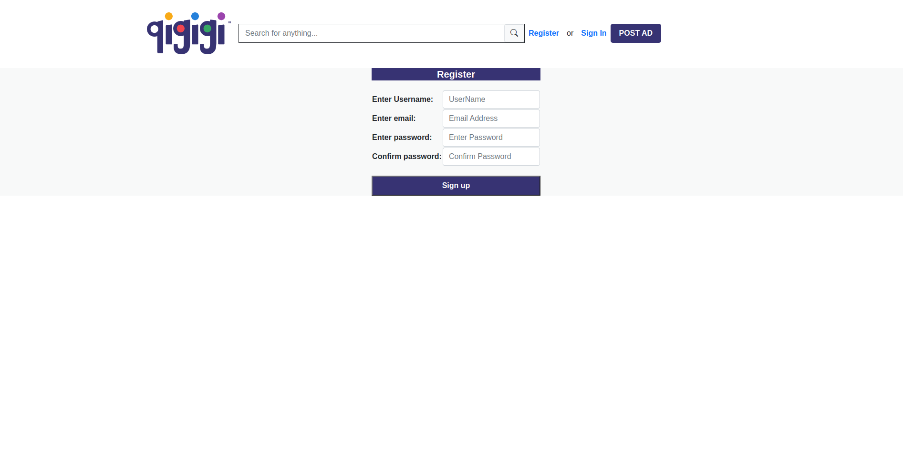

# QIGIGI 

Hello and Welcome Everyone

Qigigi is a clone of one of the most popular website in Canada. You can sell, buy or search the items and communicate with the sellers and buyers

If you want to sell your old desk or want to buy a game chair in a good condition. You can do search trough qigigi. It is easy to find the item that is a best fit to your requirements 

# 🤳 SCREENSHOTS

# 🖥️ TECHNOLOGIES USED

- HTML
- CSS
- JavaScript
- BootStrap
- Python
- Django
- PostgreSQL
- Map API
- Heroku

# 🎬 SHOWCASE

[Qigigi](https://qigigi.herokuapp.com/)

# 👨‍🔬🔬🧬 FUTURE OF THE PROJECT

- to add OAuth Login.
- to provide users a profile page
- to add message functionality.
- to add instant chat option.
- to add more features.
